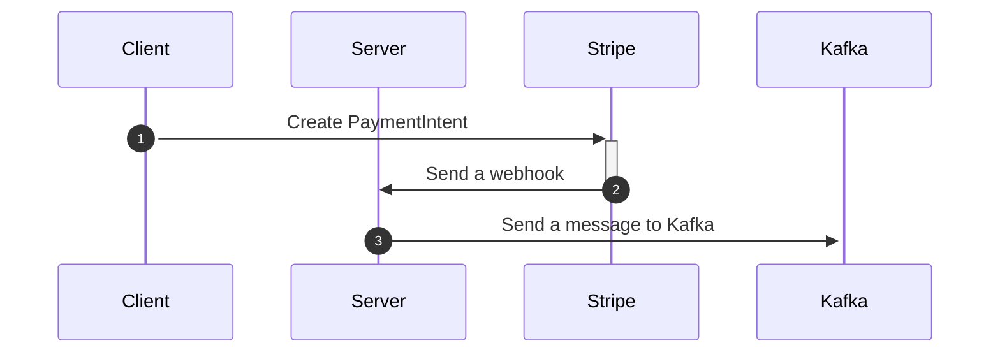

# eCommerce web appliation with Aiven Kafka and Stripe 


A full stack web app was built on RoR in order to demonstrate eCommerce clothing retails. The app demonstrates how you can produce a Stripe's webhook messages to Aiven Kafka when a consumer creates an order.


Stripe uses webhooks to notify your application when an event happens in your account. Webhooks are particularly useful for asynchronous events like when a customer’s bank confirms a payment, a customer disputes a charge, a recurring payment succeeds, or when collecting subscription payments.

This appliaction receives Stripe's webhook event for PaymentIntent creations and produces a message to Kafka topic with UUID. The producer's data should be readable from the Aiven web console from the Kafka. 



## Prerequsite
1. Sign up Aiven and create a new Aiven for Apache Kafka® service. The detail steps are described on [getting started guide on Aiven](https://developer.aiven.io/docs/products/kafka/getting-started.html).


2. [Sign up](https://dashboard.stripe.com) and create Stripe account.

3. Install Ruby 2.6.3

4. Install Postgres

## How to set up Apache Kafka® service on Aiven
1. Go to the Aiven [web console](https://console.aiven.io/) after you sign up. 

2. Select Kafka as the service type.

3. Select the cloud provider and region that you want to run your service on.

4. Select a service plan. This defines how many servers and what kind of memory, CPU, and disk resources are allocated to your service.

5. Enter a name for your service.

6. Click Create Service under the summary on the right side of the console.

## Clone the repostitory and set up your .env file.
In order to set up the application, you must download SSL certificate files from Aiven and fill in required information in .evn file.


1. Clone this repository:

    `git clone https://github.com/tmitani-stripe/fj`

2. Copy the .env.example to a .env file:

    `cp .env.example .env`

3. Download the SSL certificate files in the Aiven web console. (You will need a Apache Kafka instance on Aiven which you have created in the previous step.) 

    a. Go to the Overview page of your Aiven for Apache Kafka service.

    b. Click Download next to Access Key and save the service.key file in aiven folder. `./aiven/service.key`

    c. Click Download next to Access Certificate and save the service.cert file in aiven folder. `./aiven/service.cert`

    d. Click Download next to CA Certificate and save the ca.pem file in aiven folder. `./aiven/ca.pem`

4. Edit and fill in required information for Aiven in the .env file you copied in stripe 2 

    ```
    # Obtained from "Connection parameters" in the Aiven Console
    KAFKA_URL=

    # Obtained from "Connection parameters" in the Aiven Console
    KAFKA_PORT=

    # You must create this topic in the Aiven Console before running
    KAFKA_TOPIC=
    ```

5. go to the Stripe developer dashboard to fill Stripe's API keys in .env file.

    ```
    #Obtain your publishable key from the Stripe dashboard
    STRIPE_PUBLISHABLE_KEY=

    #Obtain your secret key from the dashboard
    STRIPE_SECRET_KEY=

    #Obtain your webhook secret from the dashboard
    STRIPE_WEBHOOK_SECRET_KEY=
    ```

## How to run this application.

1. `rails:db create`

2. `rails:db migrate`

3. `rails:db seed`

4. `bundle install`

5. `yarn install`

6. `rails s` 

7. Open localhost:3000 on your browser

Author:
@tomozilla